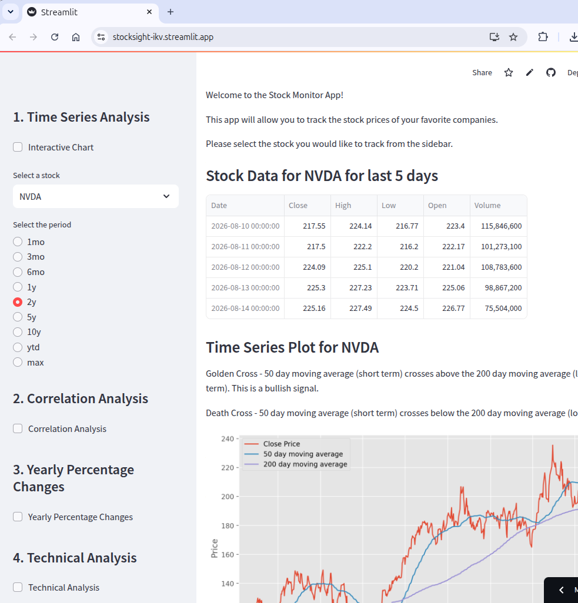

# StockSight - Stock Market Analysis & MLOps Platform

An end-to-end **MLOps** project built on S&P500 data, covering the full ML lifecycle: data ingestion, feature engineering, model training, experiment tracking, REST serving, and drift monitoring.

| | |
|---|---|
| **v0** | Live Dashboard [stocksight-ikv.streamlit.app](https://stocksight-ikv.streamlit.app) |
| **v1** | In development - multi-model prediction, MLflow experiment tracking, and Evidently drift monitoring |

**Use cases**
1. _"Is NVIDA currently overbought?"_ - check RSI and Bollinger Band signals across any supported ticker
2. _"How correlated are AAPL and MSFT over the last year?"_ - visualise cross-ticker correlation heatmaps
3. _"What will TSLA close at next week?"_ - get multi-model ML predictions via the FastAPI service *(v1)*

---

## v0 — Live



### Features

1. OHLCV data fetched from Yahoo Finance via `yfinance`
2. 50-day and 200-day moving averages of closing price
3. RSI, MACD, Bollinger Bands, and ATR technical indicators
4. Configurable time periods and ticker symbols
5. Correlation heatmap and year-on-year percentage changes

**Supported tickers:** `^GSPC` `AMZN` `TSLA` `NVDA` `AAPL` `GOOGL` `MSFT`

### Quick Start

```sh
python3 -m venv --prompt stocktracker venv
source venv/bin/activate
pip install -r requirements.txt
streamlit run src/app.py
```

### Run with Docker

```sh
docker build -t stocksight -f infra/streamlit/Dockerfile .
docker run -p 8501:8501 stocksight
```

---

## v1 — In Development

### Roadmap

| Phase | Description | Status |
|---|---|---|
| 1 | Docker Compose infrastructure (MLflow, Prefect, Postgres, MinIO) | ✅ Done |
| 2 | Feature engineering (RSI, MACD, Bollinger Bands, lag features) | ✅ Done |
| 3 | Prefect data ingestion pipeline with schema validation | ✅ Done |
| 4 | Multi-model training — Linear Regression, XGBoost, LSTM, Prophet — logged to MLflow | 🔲 Planned |
| 5 | FastAPI prediction service (`/predict`, `/health`, `/drift-status`) | 🔲 Planned |
| 6 | Evidently AI drift monitoring pipeline with scheduled reports | 🔲 Planned |
| 7 | Streamlit dashboard extended with Predictions, Model Registry, and Drift Report tabs | 🔲 Planned |
| 8a | Hybrid deployment — ML backend on cloud VM, Streamlit Cloud calls VM API | 🔲 Planned |
| 8b | Full VM migration — All services on VM, Streamlit Cloud retired | 🔲 Planned |

See [docs/REQUIREMENTS.md](docs/REQUIREMENTS.md) for the full specification.

### Full Stack Setup

```sh
make setup          # copy .env.example → .env (edit passwords first)
make build          # build Docker images
make python-venv    # create venv + install requirements
make prefect        # configure and deploy Prefect flows
make up             # start all services
```

### Service URLs

| Service | URL |
|---|---|
| Streamlit dashboard | http://localhost:8501 |
| FastAPI prediction service | http://localhost:8000/docs |
| MLflow experiment tracking | http://localhost:5000 |
| Prefect orchestration UI | http://localhost:4200 |
| MinIO artifact store | http://localhost:9000 |

---

## Project Structure

```
stocksight/
├── src/                            # All Python source code
│   ├── app.py                      # Streamlit dashboard
│   ├── models/                     # ML model implementations (Phase 4)
│   ├── pipelines/                  # Prefect flows (Phases 3, 4, 6)
│   ├── utils/                      # Data readers and feature engineering
│   └── monitoring/                 # Evidently config and reports (Phase 6)
├── tests/                          # Unit Tests
├── configs/                        # Feature and model config YAML files
├── data/
│   ├── raw/                        # Ingested OHLCV CSVs (Phase 3)
│   └── reference/                  # Drift monitoring baseline snapshot
├── infra/                          # Docker build files per service
│   ├── mlflow/
│   ├── postgres/
│   └── streamlit/
├── docs/
│   ├── REQUIREMENTS.md             # Index linking to requirements/
│   └── requirements/               # Full spec split by section
├── docker-compose.yml              # All services (Phase 1)
├── prefect.yaml                    # Prefect deployment config
├── Makefile                        # Dev workflow commands
├── requirements.txt
└── .env.example                    # Service connection strings template
```